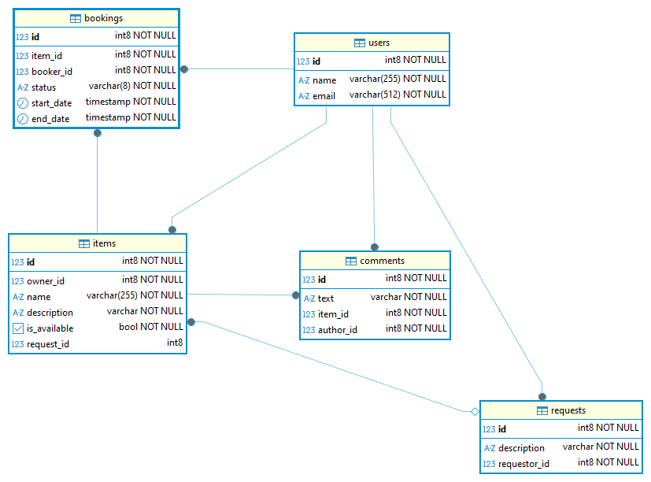

# java-shareit
Учебный проект Shareit.

Запуск postgres через docker-compose:
```(bash)
docker compose --file docker-compose.yml up --build --force-recreate -d
```
```(bash)
docker-compose start
```

# Структура БД
